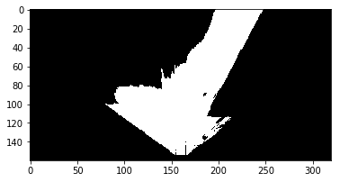
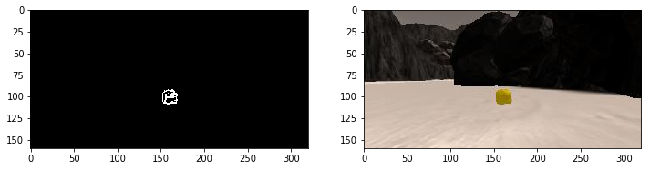

# RoboND Search and Sample Return Project

# 1. Introduction
The assignment of this project was to program rover so that it researches simulated Mars surface autonomously and pick samples that are represented as golden rocks. 

## 2. Obstacle and rock sample identification

I have done obstacle and rock sample identification by thresholding input image RGB color channels. That functionality has been implemented in the color_tresh() function.

I have used following threshold rates to do the identification:

Obstacles 
Lower RGB threshold - 160, 160, 160
Higher RGB threshold - 255,255,255

Golden rocks
Lower RGB threshold - 100,100,0
Higher RGB threshold - 230,200,60


```python
# Identify pixels above the threshold
# Threshold of RGB > 160 does a nice job of identifying ground pixels only
def color_thresh(img, rgb_thresh_lower=(160, 160, 160), rgb_thresh_upper=(255,255,255)):
    # Create an array of zeros same xy size as img, but single channel
    color_select = np.zeros_like(img[:,:,0])
    # Require that each pixel be above all three threshold values in RGB
    # above_thresh will now contain a boolean array with "True"
    # where threshold was met
    above_thresh = (img[:,:,0] > rgb_thresh_lower[0]) \
                & (img[:,:,1] > rgb_thresh_lower[1]) \
                & (img[:,:,2] > rgb_thresh_lower[2]) \
                & (img[:,:,0] <= rgb_thresh_upper[0]) \
                & (img[:,:,1] <= rgb_thresh_upper[1]) \
                & (img[:,:,2] <= rgb_thresh_upper[2])
    # Index the array of zeros with the boolean array and set to 1
    color_select[above_thresh] = 1
    # Return the binary image
    return color_select

threshed = color_thresh(warped)
plt.imshow(threshed, cmap='gray')
#scipy.misc.imsave('../output/warped_threshed.jpg', threshed*255)
```


    <matplotlib.image.AxesImage at 0x7fe0ba192d30>





```python
treshed_rock = color_thresh(rock_img, (100,100,0),(230,200,60))

fig = plt.figure(figsize=(12,3))
plt.subplot(121)
plt.imshow(treshed_rock, cmap='gray')
plt.subplot(122)
plt.imshow(rock_img)


```


    <matplotlib.image.AxesImage at 0x7fe0ba0f7710>





## 3. Implementation of the process_image() function

First step that I have done in the process_image function was transforming image perspective from rover camera perspective to "bird view", map perspective. 

Second step was thresholding images with the previously described color_thresh() function to find drivable path, obstacles and rock samples. 

The last step was adding detected drivable path, obstacles and rock samples to map in three different colors (red, green and blue). Map image has been added together with rover camera image and rover camera warped image to create image frames for the video output.

I have calculated planned steering angle as well, as preparation for the work to be done in the simulator.

Please find the video in the "output" folder. 


```python

# Define a function to pass stored images to
# reading rover position and yaw angle from csv file
# This function will be used by moviepy to create an output video
def process_image(img):
    # Example of how to use the Databucket() object defined above
    # to print the current x, y and yaw values 
    # print(data.xpos[data.count], data.ypos[data.count], data.yaw[data.count])

    # TODO: 
    # 1) Define source and destination points for perspective transform
    scale = 10
    dst_size = 5 
    bottom_offset = 6
    source = np.float32([[14, 140], [301 ,140],[200, 96], [118, 96]])
    destination = np.float32([[image.shape[1]/2 - dst_size, image.shape[0] - bottom_offset],
                      [image.shape[1]/2 + dst_size, image.shape[0] - bottom_offset],
                      [image.shape[1]/2 + dst_size, image.shape[0] - 2*dst_size - bottom_offset], 
                      [image.shape[1]/2 - dst_size, image.shape[0] - 2*dst_size - bottom_offset],
                      ])
    # 2) Apply perspective transform
    wraped, mask = perspect_transform(image, source, destination)
    # 3) Apply color threshold to identify navigable terrain/obstacles/rock samples
    binary_img=color_thresh(wraped)
    binary_img_obstacle=np.absolute(np.float32(binary_img)-1) * mask
    binary_img_rock= color_thresh(wraped, (100,100,0),(230,200,60))
    # 4) Convert thresholded image pixel values to rover-centric coords
    xpix, ypix = rover_coords(binary_img)
    xpix_rock, y_pix_rock = rover_coords(binary_img_rock)
    xpix_obstacle, y_pix_obstacle = rover_coords(binary_img_obstacle)
    # 5) Convert rover-centric pixel values to world coords
    x_world, y_world = pix_to_world(xpix, ypix, data.xpos[data.count], data.ypos[data.count], 
                                    data.yaw[data.count], data.worldmap.shape[0], scale)
    obstacle_x_world,obstacle_y_world  = pix_to_world(xpix_obstacle, y_pix_obstacle, data.xpos[data.count], 
                                data.ypos[data.count], data.yaw[data.count], data.worldmap.shape[0], scale)
    rock_x_world, rock_y_world= pix_to_world(xpix_rock, y_pix_rock, data.xpos[data.count], 
                                data.ypos[data.count], data.yaw[data.count], data.worldmap.shape[0], scale)
    
    # 6) Update worldmap (to be displayed on right side of screen)
    data.worldmap[obstacle_y_world, obstacle_x_world, 0] += 1
    data.worldmap[rock_y_world, rock_x_world, 1] += 255
    data.worldmap[y_world, x_world, 2] += 255
    
    # Calculate average angle that robot will use for steering
    distances, angles = to_polar_coords(xpix, ypix) 
    avg_angle = np.mean(angles)

    
    # 7) Make a mosaic image, below is some example code
        # First create a blank image (can be whatever shape you like)
    output_image = np.zeros((img.shape[0] + data.worldmap.shape[0], img.shape[1]*2, 3))
        # Next you can populate regions of the image with various output
        # Here I'm putting the original image in the upper left hand corner
    output_image[0:img.shape[0], 0:img.shape[1]] = img

        # Let's create more images to add to the mosaic, first a warped image
    warped, mask = perspect_transform(img, source, destination)
        # Add the warped image in the upper right hand corner
    output_image[0:img.shape[0], img.shape[1]:] = warped

        # Overlay worldmap with ground truth map
    map_add = cv2.addWeighted(data.worldmap, 1, data.ground_truth, 0.5, 0)
        # Flip map overlay so y-axis points upward and add to output_image 
    output_image[img.shape[0]:, 0:data.worldmap.shape[1]] = np.flipud(map_add)
    text = "Steering angle rad:" +  str(avg_angle)

        # Then putting some text over the image
    cv2.putText(output_image,text, (20, 20), 
                cv2.FONT_HERSHEY_COMPLEX, 0.4, (255, 255, 255), 1)
    if data.count < len(data.images) - 1:
        data.count += 1 # Keep track of the index in the Databucket()
    
    return output_image
```

## 4. Explanation of perception_step() and decision_step() functions

In the perception_step() function (perception.py, line 97) I have implemented basically the same code as in the process_image() function in the Jupyter Notebook assignment. I have additionally converted drivable area and rock sample coordinates to polar coordinates, so that the rover can operate based on them. When the rock sample is sighted, angles and distances of rock samples are exported to the decision_step() function. Otherwise angles and distances of drivable area are exported.

In the decision_step() function (decision.py, line 7) I have added one additional "collect_sample" state (line 47). There I have defined hovers behavior when a rock sample has been spotted. Hover moves towards rock sample and stops in front of it, so that a sample can be picked up. I have implemented one additional functionality as expansion of "forward" and "stop" states so that the rover rotates in place in case when it is stuck and does not move for some time.

## 5. Conclusion

This was very interesting assignment where we were introduced with perception, decision and reaction steps in practice. I found the assignment very engaging, as I had all the tools necessary to implement the solution.

There is still room for improvement in rover navigation, rover can go faster and do better job in avoiding rocks, especially those in the middle of the map. Additional improvements can be made to make sure that the whole map has been covered so that the rover always researches 100% of the drivable area.

I have used 1440x900 screen resolution with "Fantastic" graphics quality. Please find Youtube video under the following link:

https://www.youtube.com/watch?v=Y0AuFCVMuoA&t=155s
